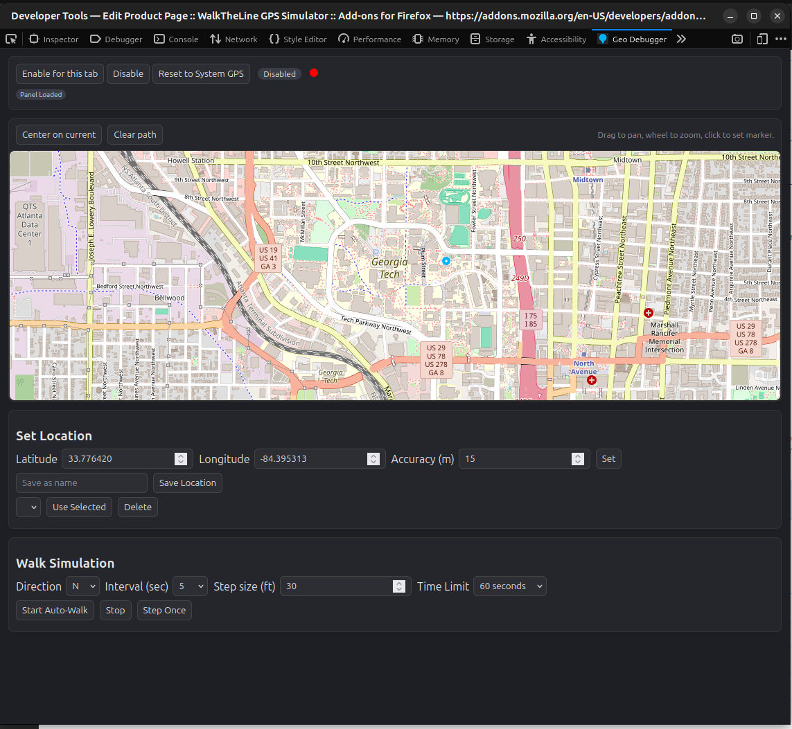

#   WalkTheLine - Firefox Geolocation Debugger Extension

WalkTheLine: Geolocation Debugger for Firefox. A powerful extension for developers and testers to debug geolocation-dependent web applications. Easily spoof your browser's reported location, set fixed coordinates, or simulate movement (walking) with customizable speed and direction. Control everything from a dedicated DevTools panel, including saving frequently used locations. Ideal for testing location-aware features without physical travel. Transparent and user-friendly.

[Download in the Firefox Browser Add-ons Store](https://addons.mozilla.org/en-US/firefox/addon/walktheline-gps-simulator/)

## Project Overview

WalkTheLine is a Firefox browser extension designed to assist developers and testers in debugging geolocation-dependent web applications. It allows users to spoof their browser's reported geographical location, enabling testing of location-aware features without physical movement.

The extension provides the following core functionalities:

*   **Geolocation Spoofing:** Override the `navigator.geolocation` API to report custom latitude, longitude, and accuracy.
*   **Fixed Position Setting:** Manually set a specific location.
*   **Simulated Movement:** Simulate "walking" in a given direction (North, South, East, West) at a specified interval and step size, updating the spoofed location dynamically.
*   **Time-Limited Simulation:** Set a duration for the simulated walk, after which it will automatically stop.
*   **DevTools Integration:** A dedicated "Geo Debugger" panel within Firefox's Developer Tools provides a user interface for controlling the spoofing parameters, including a simple map visualization.
*   **Saved Locations:** Ability to save and load frequently used locations.

## Installation (for Developers)

This project does not require a separate build step. It can be loaded directly into Firefox as a temporary add-on for development and testing.

**Steps to Load the Extension:**

1.  Open Firefox.
2.  Type `about:debugging#/runtime/this-firefox` in the address bar and press Enter.
3.  Click on "Load Temporary Add-on...".
4.  Navigate to the directory where you have cloned/downloaded this project.
5.  Select any file within the directory (e.g., `manifest.json`). Firefox will load the entire extension.

Once loaded, you can open the Developer Tools (F12 or Ctrl+Shift+I) on any tab, and you should see a new "Geo Debugger" panel.

## Usage

1.  Open Firefox Developer Tools (F12 or Ctrl+Shift+I).
2.  Navigate to the "Geo Debugger" panel.
3.  Use the controls to:
    *   Enable/Disable geolocation spoofing for the current tab.
    *   Set a fixed latitude, longitude, and accuracy.
    *   Start/Stop a simulated walk in a specified direction and speed.
    *   Save and load frequently used locations.

## Known Limitations

*   **Advanced Detection Sites:** Some websites (e.g., `browserleaks.com/geo`) employ advanced detection techniques (like WebRTC IP leaks or extensive browser fingerprinting) that go beyond the `navigator.geolocation` API. This extension only spoofs the `navigator.geolocation` API and cannot hide your real IP address or other browser fingerprints.
*   **Persistence of Walk Simulation:** The walk simulation will continue even if the DevTools panel is closed, as the background script is set to be persistent. However, if Firefox is completely closed, the simulation will stop.

## For Publishing to Firefox Add-ons Store

Before publishing, ensure you update the `browser_specific_settings.gecko.id` in `manifest.json` to a unique ID that you own (e.g., `your-addon-name@your-domain.com`).

### AMO Product Page Description
